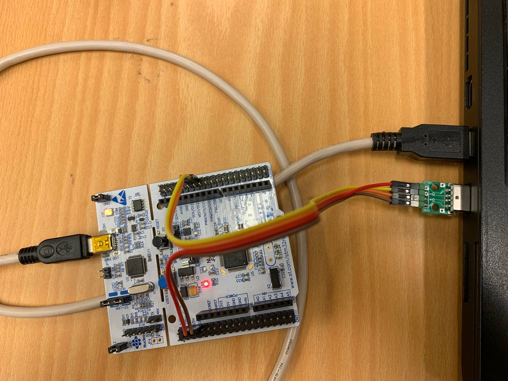

## Setup

This example is implemented using a `NUCLEO-F411RE` that contains an `STM32F411RET6` processor. As the main USB port on this device isn't connected directly to the processor, but to the st-link programmer, an external USB connection will be needed for the sound card to work. This can be achieved by using a USB breakout/connector using the following pin out.

| USB breakout | Nucleo |
|:-------------|:-------|
| GND          | GND    |
| VBUS         | E5V    |
| D+           | PA12   |
| D-           | PA11   |

For USB to work as intended the processor needs to use an external crystal (HSE) with a more precise speed. This is included as a signal from the st-link programmer on the Nucleo board, so you will not have to take this in regard when using these. But for any non-Nucleo board you should make sure to add one. The one used on the Nucleo is an 8 MHz oscillator, but this can be changed to another speed in `src/main.rs`.
